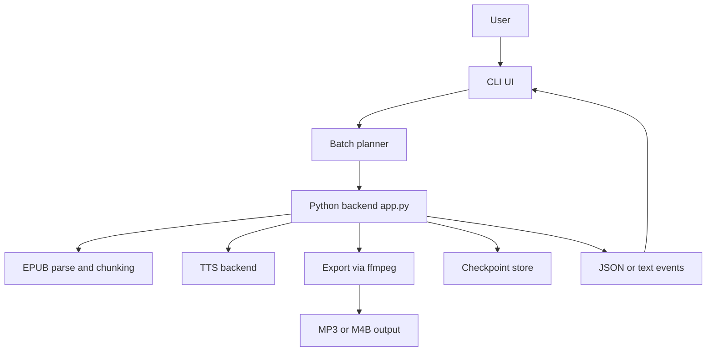

# Project Architecture

This document describes how AI Audiobook Fast is structured and how the current runtime behaves.

## Overview

The project is a process-based system with a terminal UI frontend and a Python backend:

- `cli/` (TypeScript + Ink): user workflow, batch planning, batch review, execution UI, and recovery logic
- `app.py` (Python): EPUB parsing, text chunking, TTS generation, checkpointing, and `ffmpeg` export
- `backends/` (Python): pluggable TTS backends (`pytorch`, `mlx`, `mock`)
- `checkpoint.py` (Python): checkpoint state, chunk persistence, validation, and inspection

The interactive CLI launches the Python backend as a subprocess and consumes backend events from `stdout` and `stderr`.

## High-Level Runtime Flow



## Component Responsibilities

### CLI (`cli/`)

Primary responsibilities:
- Run startup preflight checks for `ffmpeg`, the Python virtual environment, Python dependencies, and `app.py`
- Collect input files and configuration
- Show the M4B metadata editor for single-file M4B runs
- Inspect every selected job before execution
- Render the batch review screen, including resumable jobs, warnings, and blocked collisions
- Launch backend runs, parse progress events, and render live batch progress
- Apply Apple Silicon recovery logic for recoverable native backend failures

Key files:
- `cli/src/App.tsx`: top-level state machine and workflow orchestration
- `cli/src/components/ConfigPanel.tsx`: configuration wizard
- `cli/src/components/MetadataEditor.tsx`: single-file M4B metadata review and override UI
- `cli/src/components/BatchReview.tsx`: review screen for planned jobs
- `cli/src/components/BatchProgress.tsx`: live processing UI
- `cli/src/utils/batch-planner.ts`: per-file inspection and batch plan construction
- `cli/src/utils/batch-scheduler.ts`: sequential scheduler that skips blocked or errored jobs
- `cli/src/utils/tts-runner.ts`: backend subprocess runner, parser, logging, and retry logic
- `cli/src/utils/preflight.ts`: environment checks
- `cli/src/utils/metadata.ts`: `--extract_metadata` helper
- `cli/src/utils/checkpoint.ts`: `--check_checkpoint` helper and checkpoint deletion helper
- `cli/src/utils/python-runtime.ts`: Python interpreter and project-path resolution

### Python Backend (`app.py`)

Primary responsibilities:
- Parse CLI arguments and validate inputs
- Resolve the effective backend (`auto` or explicit)
- Resolve the effective pipeline mode
- Parse EPUB chapters and split text into chunks
- Emit progress, metadata, checkpoint, inspection, and log events
- Create, validate, reuse, and clean up checkpoints
- Run TTS inference and audio conversion
- Export MP3 or M4B output with `ffmpeg`

### TTS Backends (`backends/`)

- `kokoro_pytorch.py`: Kokoro backend using PyTorch, optionally with MPS on Apple Silicon
- `kokoro_mlx.py`: MLX backend for Apple Silicon via `mlx-audio`
- `mock.py`: deterministic backend for tests and subprocess validation
- `factory.py`: backend creation and availability discovery

## CLI Workflow

`cli/src/App.tsx` currently uses this screen sequence:

1. `checking`
2. `setup-required` or `welcome`
3. `files`
4. `config`
5. `metadata` for single-file `m4b` only
6. `planning`
7. `review`
8. `processing`
9. `done`

Important behavior:
- The CLI plans the entire batch before execution starts.
- Planning resolves output paths, estimates total characters and chunks, extracts EPUB metadata, and evaluates checkpoint compatibility per file.
- Multi-file M4B runs do not keep metadata override fields; only single-file M4B runs pass title, author, and cover overrides through the metadata editor.
- The review screen offers a batch-level `Start fresh for all resumable jobs` action. There is no active per-file resume dialog in the current flow.
- Jobs with inspection failures or output collisions are marked skipped, while ready jobs still run.

## Batch Planning and Review

The batch planner lives in `cli/src/utils/batch-planner.ts`.

### Planning algorithm

For each selected input file, the planner:
1. Builds the output path from the chosen format and output directory
2. Builds the execution config used for inspection
3. Calls `app.py --inspect_job --event_format json`
4. Parses the backend `inspection` event
5. Chooses a checkpoint action:
   - `resume` when checkpointing is enabled and the checkpoint is fully resumable with saved chunk audio
   - `start-fresh` when a checkpoint exists but is not resumable
   - `ignore` when checkpointing is disabled or no checkpoint exists
6. Marks duplicate output paths as blocked
7. Stores warnings, errors, metadata, and estimates in a `BatchPlan`

Important planner behavior:
- Planning is fault-tolerant per file. If inspection fails for one EPUB, that job gets an error entry and the planner continues with the rest of the batch.
- Existing checkpoints are not deleted during planning.
- Metadata overrides are stripped unless the batch contains exactly one file and the output format is `m4b`.

### Review screen behavior

`cli/src/components/BatchReview.tsx` renders:
- Summary counts for ready, resumable, warning, error, and blocked jobs
- Per-job metadata, output path, checkpoint action, and first warning or error
- One of three actions:
  - Start the ready jobs
  - Start fresh for all resumable jobs
  - Go back to configuration

## Backend Pipeline

### 1. Argument parsing and early modes

`app.py` parses runtime flags in these groups:
- Generation: `--voice`, `--lang_code`, `--speed`, `--chunk_chars`, `--split_pattern`
- Backend and export: `--backend`, `--format`, `--bitrate`, `--normalize`
- Checkpoint: `--checkpoint`, `--resume`, `--check_checkpoint`
- Pipeline: `--pipeline_mode`, `--prefetch_chunks`, `--pcm_queue_size`, `--workers`
- Integration: `--event_format`, `--log_file`, `--no_rich`
- Metadata and planning: `--extract_metadata`, `--inspect_job`, `--title`, `--author`, `--cover`

Early-exit modes:
- `--extract_metadata`: parse EPUB metadata and emit metadata events, then exit
- `--check_checkpoint`: report checkpoint existence and hash compatibility, then exit
- `--inspect_job`: emit a structured inspection result with metadata, estimates, warnings, errors, and checkpoint compatibility, then exit

### 2. Backend resolution

`--backend auto` resolves at runtime:
- On Apple Silicon macOS, it prefers MLX if `mlx-audio` is installed and the MLX probe succeeds
- Otherwise it falls back to PyTorch
- On non-macOS or non-Apple Silicon hosts, it resolves to PyTorch

The resolved backend is emitted as `metadata.backend_resolved`.

### 3. Pipeline mode selection

The backend accepts explicit `--pipeline_mode` values of `sequential` or `overlap3`.

Current runtime default:
- If `--pipeline_mode` is omitted, `default_pipeline_mode(...)` currently resolves to `sequential`

Restriction:
- If `--pipeline_mode overlap3` is requested for anything other than MP3 without checkpointing, the backend emits a warning and falls back to `sequential`

#### Pipeline modes

| Mode | What it does | When used |
| --- | --- | --- |
| `sequential` | Single loop for parse state, inference, checkpoint writes or reuse, and spool or stream output coordination | Current default and required for checkpointed runs and M4B |
| `overlap3` | Threaded inference and conversion with direct MP3 export coordination | Explicitly requested MP3 runs without checkpointing |

## Data Processing Flow

### Parsing and chunking

1. Emit `phase=PARSING`
2. Parse EPUB content into chapters
3. Emit `parse_progress` events while walking EPUB items
4. Split text into chunks using `split_text_to_chunks`
5. Emit metadata such as total characters and chapter count

Chunk size defaults when `--chunk_chars` is omitted:
- MLX: `900`
- PyTorch: `600`

### Checkpoint and resume preparation

If checkpointing is active (`--checkpoint` or `--resume`):
- The checkpoint directory is computed as `<output>.checkpoint`
- Resume validation compares the EPUB hash plus key runtime settings:
  - `voice`
  - `speed`
  - `lang_code`
  - resolved `backend`
  - `chunk_chars`
  - `split_pattern`
  - `format`
  - `bitrate`
  - `normalize`
- Chunk count must also match the current chunking pass

If valid resume data exists, completed chunks can be reused from saved `.npy` files.

### Inference stage

The backend emits `phase=INFERENCE`, then runs one of the pipeline implementations.

#### Sequential pipeline

For each chunk, the backend:
- Reuses checkpointed chunk audio when resuming and the saved `.npy` file exists
- Otherwise calls the selected backend `generate(...)`
- Converts audio to `int16`
- Writes PCM to the streaming MP3 exporter or a spool file
- Saves checkpoint chunk audio when checkpointing is enabled
- Emits worker, timing, progress, and checkpoint events

#### `overlap3` pipeline

Current behavior:
- MP3 only
- No checkpoint support
- Uses an inference thread and a conversion thread
- Streams PCM directly into an `ffmpeg` MP3 process

### Concatenating phase

The backend still emits `phase=CONCATENATING` for protocol compatibility.

Current runtime meaning:
- Audio has already been streamed or spooled during inference
- The phase exists to preserve expected progress semantics and finalize chapter offsets for later export

### Export phase

The backend emits `phase=EXPORTING` and finalizes the output with `ffmpeg`.

#### MP3 export

Two paths exist:
- Streaming path when output is MP3 and checkpointing is off
- File-based path when a PCM spool file is required

#### M4B export

- Always uses a file-based PCM spool path
- Builds `ffmetadata` for title, author, and chapter entries
- Optionally attaches cover art for `jpg`, `jpeg`, `png`, or `gif`
- Encodes audio as AAC inside `.m4b`

Runtime export is `ffmpeg`-first. `pydub` is present in the dependency set but is not the primary export mechanism.

### Completion and cleanup

On success:
- Output is finalized
- Average chunk timing is reported
- Checkpoint data is cleaned up if checkpoint mode was active
- A `done` event is emitted

On failure:
- An error event is emitted
- Checkpoint artifacts remain on disk for resume or debugging
- Temporary spool files and subprocess resources are cleaned up where possible

## Checkpoint Architecture

See `CHECKPOINTS.md` for user-facing and operator-facing guidance. This section focuses on internals.

### Storage layout

For output `book.mp3`, checkpoint data is stored in:

- `book.mp3.checkpoint/state.json`
- `book.mp3.checkpoint/chunk_000000.npy`
- `book.mp3.checkpoint/chunk_000001.npy`
- ...

### `state.json` contents

- `epub_hash`: SHA-256 of the input EPUB
- `config`: generation and export settings used for compatibility checks
- `total_chunks`: chunk count for the run
- `completed_chunks`: chunk indexes already persisted
- `chapter_start_indices`: chapter boundary references for later chapter metadata generation

### Validation rules

Resume proceeds only when:
- EPUB hash matches
- Runtime configuration matches
- Chunk count matches the current chunking output

Missing chunk audio files are treated as recoverable. The runtime removes those chunks from the completed set and regenerates them.

## IPC and Event Protocol

The backend emits events through `EventEmitter` in one of two formats:

- `text`: legacy human-readable lines
- `json`: structured events used by the interactive CLI runner and the batch planner

### Event categories

Current event types:
- `phase`
- `metadata`
- `timing`
- `parse_progress`
- `heartbeat`
- `worker`
- `progress`
- `checkpoint`
- `inspection`
- `error`
- `done`
- `log` in JSON mode for `info()` and `warn()` output

### Example JSON events

```json
{"type":"phase","phase":"INFERENCE","ts_ms":1730000000000,"job_id":"book.mp3"}
{"type":"parse_progress","current_item":4,"total_items":12,"current_chapter_count":3,"ts_ms":1730000000100,"job_id":"book.mp3"}
{"type":"progress","current_chunk":12,"total_chunks":80,"ts_ms":1730000001234,"job_id":"book.mp3"}
{"type":"checkpoint","code":"SAVED","detail":11,"ts_ms":1730000001300,"job_id":"book.mp3"}
```

### Example inspection event

```json
{
  "type": "inspection",
  "result": {
    "input_path": "book.epub",
    "output_path": "book.mp3",
    "resolved_backend": "pytorch",
    "resolved_chunk_chars": 600,
    "resolved_pipeline_mode": "sequential",
    "total_chars": 123456,
    "total_chunks": 80,
    "chapter_count": 12,
    "epub_metadata": {
      "title": "Book Title",
      "author": "Author",
      "has_cover": true
    },
    "checkpoint": {
      "exists": true,
      "resume_compatible": true,
      "completed_chunks": 20,
      "total_chunks": 80,
      "missing_audio_chunks": []
    },
    "warnings": [],
    "errors": []
  }
}
```

### Example text events

```text
PHASE:INFERENCE
PARSE_PROGRESS:4/12:3
METADATA:total_chars:123456
PROGRESS:12/80 chunks
CHECKPOINT:SAVED:11
DONE
```

## CLI Event Parsing and Recovery

### Main runner

`cli/src/utils/tts-runner.ts`:
- Spawns the backend subprocess
- Always passes `--event_format json`, `--log_file <path>`, and `--no_rich`
- Stores backend logs under `~/.audiobook-maker/logs` when possible, or falls back to `<repo>/.logs`
- Parses JSON first, then falls back to legacy text parsing
- Preserves parser state across partial event streams so UI updates stay stable

### Helper subprocesses

Some helper utilities still use older narrow flows:
- `cli/src/utils/metadata.ts` uses `--extract_metadata`
- `cli/src/utils/checkpoint.ts` uses `--check_checkpoint`

### Apple Silicon recovery behavior

The CLI runner may retry once after a recoverable native backend failure on Apple Silicon hosts.

Current fallback profile:
- Backend forced to `pytorch`
- GPU disabled (`useMPS = false`)
- Pipeline forced to `sequential`
- Smaller `chunk_chars`

This recovery path is disabled for the `mock` backend and for clearly non-recoverable failures such as missing files or invalid EPUB input.

## Environment and Runtime Settings

### Python runtime resolution

`cli/src/utils/python-runtime.ts` resolves Python in this order:
1. `AUDIOBOOK_PYTHON`
2. `PYTHON`
3. repo `.venv` Python
4. `python3`
5. `python`

### Runtime environment variables

Recognized or relevant variables:
- `AUDIOBOOK_PYTHON`: preferred Python interpreter for CLI subprocesses
- `PYTHON`: secondary Python override
- `AUDIOBOOK_VERBOSE`: echo parsed backend lines to CLI stderr
- `AUDIOBOOK_OMP_THREADS`: override derived `OMP_NUM_THREADS`
- `AUDIOBOOK_OPENBLAS_THREADS`: override derived `OPENBLAS_NUM_THREADS`

For PyTorch MPS paths, the CLI runner may set:
- `PYTORCH_ENABLE_MPS_FALLBACK=1`
- `PYTORCH_MPS_HIGH_WATERMARK_RATIO=0.0`
- `OMP_NUM_THREADS=<derived or override>`
- `OPENBLAS_NUM_THREADS=<derived or override>`

## Code Map

### Backend

- `app.py`: entry point, orchestration, event emission, export paths
- `checkpoint.py`: checkpoint hash, validation, persistence, and inspection
- `backends/base.py`: backend interface
- `backends/factory.py`: backend creation and discovery
- `backends/kokoro_pytorch.py`: PyTorch backend
- `backends/kokoro_mlx.py`: MLX backend
- `backends/mock.py`: deterministic test backend

### CLI

- `cli/src/App.tsx`: workflow and state transitions
- `cli/src/utils/batch-planner.ts`: inspection and `BatchPlan` construction
- `cli/src/utils/batch-scheduler.ts`: job scheduling and skipping
- `cli/src/utils/tts-runner.ts`: subprocess management, parsing, and recovery
- `cli/src/utils/preflight.ts`: setup verification
- `cli/src/utils/metadata.ts`: metadata extraction helper
- `cli/src/utils/checkpoint.ts`: checkpoint probe and deletion helper
- `cli/src/components/*.tsx`: user-facing screens and widgets

## Current Constraints and Tradeoffs

- `--workers` is a compatibility flag in the backend; inference remains sequential.
- `overlap3` is intentionally restricted because checkpoint reuse and M4B export require sequential or spool semantics.
- `ffmpeg` is a hard system dependency for output generation.
- Runtime export is `ffmpeg`-first even though `pydub` is installed.
- Sample rate is backend-defined and currently `24000` for the bundled PyTorch and MLX backends.

## Related Docs

- `README.md`
- `CHECKPOINTS.md`
- `FORMATS_AND_METADATA.md`
- `CLAUDE.md`
