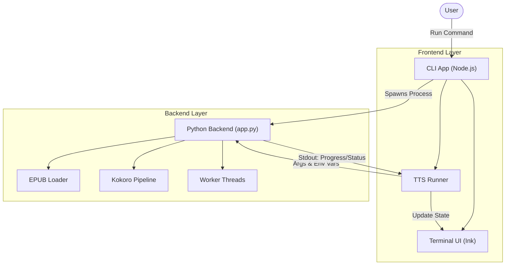
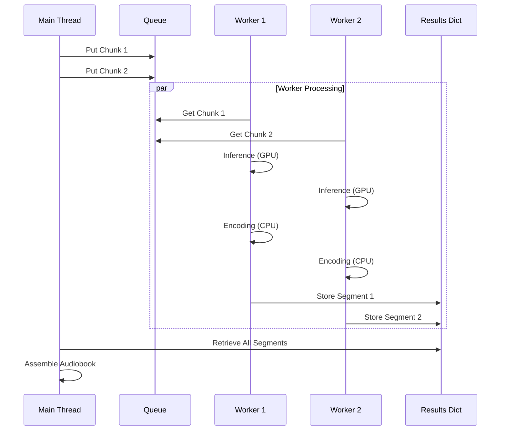
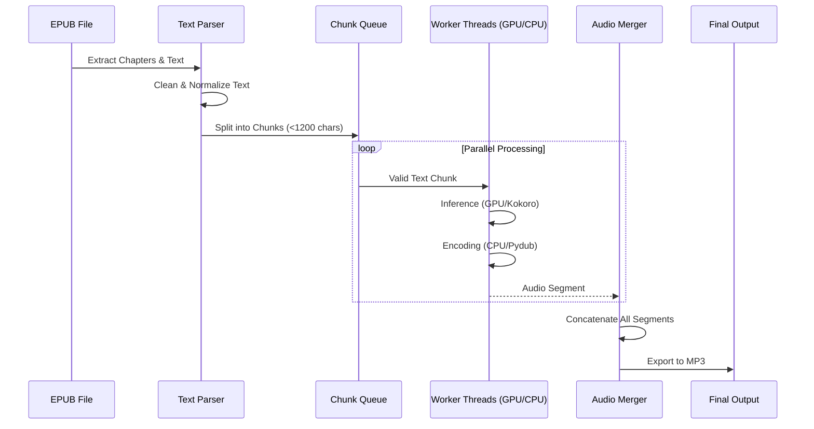

# Project Architecture

This document describes the technical structure and architecture of the AI Audiobook generator.

## System Overview

The project consists of two main components:
1.  **Frontend CLI**: A Node.js/TypeScript application providing a rich terminal user interface (TUI).
2.  **Backend Core**: A Python script (`app.py`) that handles the heavy lifting of EPUB parsing and Text-to-Speech (TTS) generation using the Kokoro model.

The CLI acts as a controller, spawning the Python process and visualizing its progress in real-time.

## Directory Structure
```
ai_audiobook_fast/
├── app.py                  # Core Python backend script
├── cli/                    # Frontend CLI Application
│   ├── src/                # Source code
│   │   ├── utils/          # Utilities (e.g., tts-runner)
│   │   └── components/     # UI Components (React/Ink)
│   ├── package.json        # CLI dependencies
│   └── tsconfig.json       # TypeScript configuration
├── requirements.txt        # Python dependencies
└── README.md               # Project documentation
```

## System Architecture

The interaction between the CLI and the Python backend is process-based. The CLI spawns the python script and communicates via `stdout`/`stderr`.



## Parallel Processing Strategy

To maximize performance, especially on machines with capable GPUs (like Apple Silicon), the system employs a parallel processing pipeline.

### Producer-Consumer Pattern
- **Producer**: The main thread reads the EPUB, cleans the text, and splits it into optimal chunks (default ~1200 chars). These chunks are pushed into a thread-safe `queue.Queue`.
- **Consumers**: Multiple worker threads (default: 2) pull chunks from the queue and process them independently.

### Worker Lifecycle
Each worker performs two distinct stages for every chunk:
1.  **Inference (GPU-bound)**: The worker uses the `kokoro` pipeline to generate raw audio data. On Apple Silicon, this leverages MPS (Metal Performance Shaders) for acceleration.
2.  **Encoding (CPU-bound)**: The raw audio is converted to an `AudioSegment` (16-bit PCM, 24kHz) using `pydub`/`numpy`.

### Synchronization
- **Results Storage**: Completed audio segments are stored in a dictionary keyed by chunk index (`results_dict`). A `threading.Lock` facilitates safe concurrent writes.
- **Ordered Assembly**: After all chunks are processed, the main thread reassembles the audio segments in the correct order (0 to N) to ensure the audiobook flows correctly.
- **Console Output**: A dedicated `print_lock` ensures that status updates from multiple threads (e.g., `WORKER:0:INFER...`) do not interleave and corrupt the output parsing by the CLI.




## Data Flow

The data flow pipeline transforms an EPUB file into a single MP3 audio file.



## Key Components

### 1. Python Backend (`app.py`)
- **Libraries**: `kokoro` (TTS), `ebooklib` (EPUB), `pydub` (Audio), `torch`.
- **Concurrency**: Uses `threading` to run multiple workers. Each worker handles both inference (GPU-bound) and encoding (CPU-bound) for a chunk.
- **IPC**: Prints structured logs (e.g., `WORKER:0:INFER:...`) to `stdout` which the CLI parses.

### 2. CLI Frontend (`cli/`)
- **Stack**: `React`, `Ink`, `TypeScript`.
- **Responsibility**: 
    - Argument parsing.
    - Process management (spawning `app.py`).
    - Visualizing workers status and overall progress.
